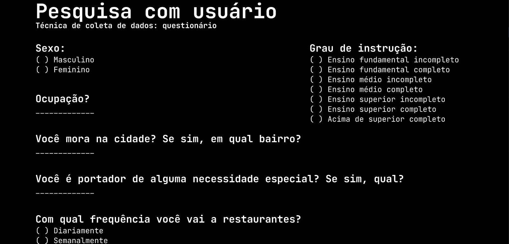
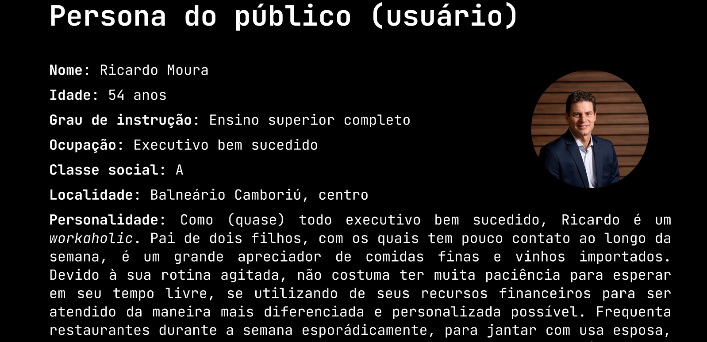
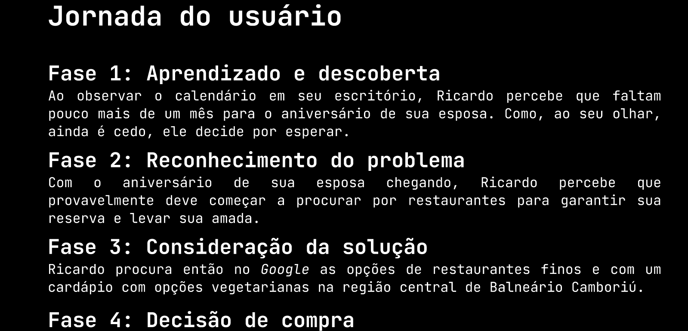

# Design thinking

This README contains the structure for a complete design process from a product to a user journey. The designs are created in Figma and aim to provide a comprehensive overview of the user experience.

You can check the full project in [Figma](https://www.figma.com/design/q0sdOarf3El5ePa63Mjupu/ATIVIDADE-AULA---27%2F05?node-id=0-1&node-type=canvas).

## Pages Included

### 1. Product Page

    

**Link**: [View full Product Page in Figma](https://www.figma.com/proto/q0sdOarf3El5ePa63Mjupu/ATIVIDADE-AULA---27%2F05?node-id=6-119&node-type=canvas&scaling=scale-down-width&content-scaling=fixed&page-id=0%3A1&hide-ui=1)

### 2. User Survey

    

**Link**: [View full User Survey Page in Figma](https://www.figma.com/proto/q0sdOarf3El5ePa63Mjupu/ATIVIDADE-AULA---27%2F05?node-id=3-15&node-type=canvas&scaling=scale-down-width&content-scaling=fixed&page-id=0%3A1&hide-ui=1)

### 3. Persona

    

- **Link**: [View full Persona Page in Figma](https://www.figma.com/proto/q0sdOarf3El5ePa63Mjupu/ATIVIDADE-AULA---27%2F05?node-id=6-188&node-type=canvas&scaling=scale-down-width&content-scaling=fixed&page-id=0%3A1&hide-ui=1)

### 4. User Journey

    

- **Link**: [View full User Journey Page in Figma]([your-figma-link-here](https://www.figma.com/proto/q0sdOarf3El5ePa63Mjupu/ATIVIDADE-AULA---27%2F05?node-id=6-283&node-type=canvas&scaling=scale-down-width&content-scaling=fixed&page-id=0%3A1&hide-ui=1))
